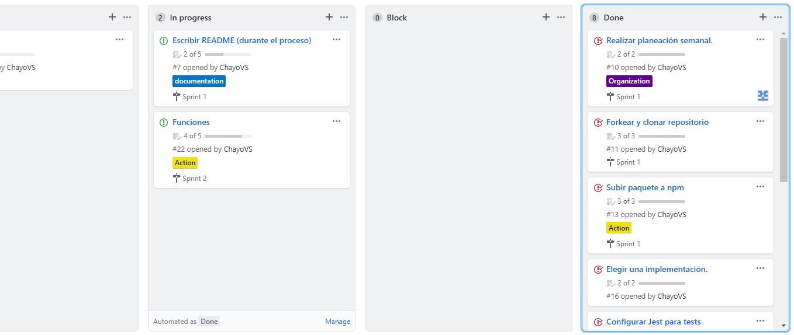
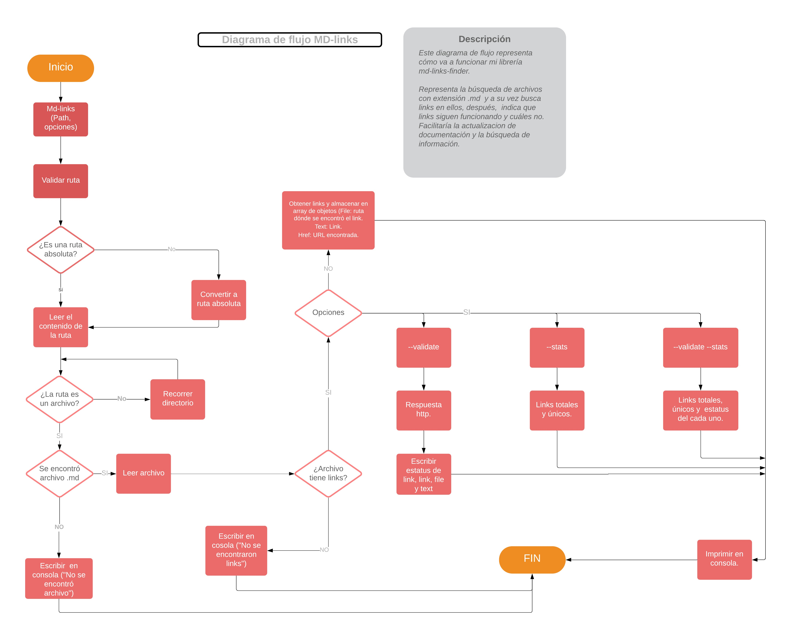

# Md-links-finder

## Índice

* [1. Preámbulo](#1-preámbulo)
* [2. Md-links-finder-rvs](#2-md-links-finder-rvs)
* [3. Antes de empezar](#3-antes-de-empezar)
* [4. ¿Cómo instalar Md-links-finder-rvs?](#4-¿cómo-instalar-md-links-finder-rvs?)
* [5. ¿Cómo utilizar Md-links-finder-rvs?](#5-¿cómo-utilizar-md-links-finder-rvs?)
* [6. Herramientas utilizadas](#6-herramientas-utilizadas)
* [7. Autora](#7-autora)

***

## 1. Preámbulo. :clipboard:

Markdown es un lenguaje de marcado ligero que es muy utilizado por desarrolladores (developers), pretende facilitar la lectura al usuario, en el ámbito de programación se emplean para escribir documentos complementarios (cómo los README en Github) que proporcionan información adicional, una descripción del proyecto, instrucciones, entre otros.

Para ofrecer explicaciones más completas, en estos archivos se hace uso de mandar a información externa por medio de links. Después de un tiempo puede ser que la página a la que manda el link ya no exista ó haya cambiado de ruta, y es molesto para el usuario ya que no le ofrece lo que busca, por medio de esta librería se resuelve este problema, ya que permitirá al developer mantener actualizados los links de sus archivos .md.

***

## 2. Md-links-finder-rvs. :bulb:

Es una librería que  a través de una ruta (definida por el usuario) detecte archivos en formato .md, después detecte los links contenidos en ese archivo y el usuario podrá definir que hacer con los links, si sólo mostrar una estadística, o validarlos (funcionales o no), incluso podrá realizar ambas cosas.

***

## 3. Antes de empezar. :calendar:
* Se definió un plan cada semana, para cubrir el total de los requerimientos.

* Para plantear mejor la solución al problema se definió el plan a seguir mediante un diagrama de flujo.

***

## 4. ¿Cómo instalar Md-links-finder-rvs? :inbox_tray:

Tener instalado Nodejs.

Instalar a través del comando de NPM:

`npm i md-links-finder-rvs`

***

## 5. ¿Cómo utilizar Md-links-finder-rvs? :grey_question:

* Utilizaremos siempre el comando `md-links-finder-rvs` seguido de la ruta que vayamos a leer, ejemplo:
md-links-finder-rvs ./fileRead/info.md

* Próxima versión disponible: dependiendo de lo que se requiera, se agrega a lo anterior las opciones: `--validate`, `--stats`, `--validate --stats`

***

## 6. Herramientas utilizadas. :hammer:

Se implementaron las siguientes librerías: 
* Figlet Estilo para darle encabezado, o modificar librería.
* Chalk Para darle color a los textos.
* Marked A través de la función marked devuelve el contenido html.
* Filehound Probando su funcionalidad.
* Node-fetch Probando funcionalidad.

Así cómo:

* NPM
* Nodejs
* Github
* Jest

***

## 7. Autora. :black_nib:

Rosario Vazquez Salazar
