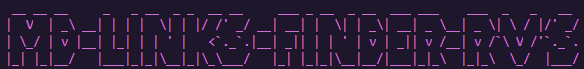

# Md-links-finder

## Índice

* [1. Preámbulo](#1-preámbulo)
* [2. Md-links-finder](#2-md-links-finder)
* [3. Antes de empezar](#3-antes-de-empezar)
* [4. ¿Cómo instalar Md-links-finder?](#4-¿cómo-instalar-md-links-finder?)
* [5. ¿Cómo utilizar Md-links-finder?](#5-¿cómo-utilizar-md-links-finder?)
* [6. Creación de la librería](#6-creación-de-la-librería)
* [7. Herramientas utilizadas](#7-herramientas-utilizadas)
* [8. Referencias](#8-referencias)
* [9. Autora](#9-autora)

***

## 1. Preámbulo. 

Markdown es un lenguaje de marcado ligero que es muy utilizado por desarrolladores (developers), pretende facilitar la lectura al usuario, en el ámbito de programación se emplean para escribir documentos complementarios (cómo los README en Github) que proporcionan información adicional, una descripción del proyecto, instrucciones, entre otros.

Para ofrecer explicaciones más completas, en estos archivos se hace uso de mandar a información externa por medio de links. Después de un tiempo puede ser que la página a la que manda el link ya no exista ó haya cambiado de ruta, y es molesto para el usuario ya que no le ofrece lo que busca, por medio de esta librería se resuelve este problema, ya que permitirá al developer mantener actualizados los links de sus archivos .md.

***

## 2. Md-links-finder.

Es una librería que  a través de una ruta (definida por el usuario) detecte archivos en formato .md, después detecte los links contenidos en ese archivo y el usuario podrá definir que hacer con los links, si sólo mostrar una estadística, o validarlos (funcionales o no), incluso podrá realizar ambas cosas.

***

## 3. Antes de empezar.

## 4. ¿Cómo instalar Md-links-finder? :inbox_tray:

## 5. ¿Cómo utilizar Md-links-finder? :grey_question:

## 6. Creación de la librería. :wrench:

## 7. Herramientas utilizadas. :hammer:

## 8. Referencias. :books:

## 9. Autora. :black_nib:

Rosario Vazquez Salazar
